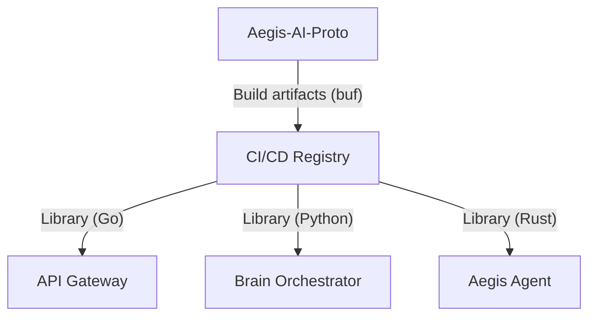

# 📜 Aegis AI — Protocol & Service Definitions (Proto)

**Project ID:** AEGIS-CORE-2026

> The **Aegis AI Proto** repository is the central source of truth for all cross-service communication contracts. It defines the strictly-typed gRPC schemas that govern how the platform's microservices interact, ensuring total interoperability between **Go**, **Python**, and **Rust** components.

---

## 🏗️ Role in the Ecosystem

This repository acts as the **Blueprint** for the entire Aegis infrastructure. It centralizes:
- **Authentication Contracts**: JWT exchange and session management protos.
- **Scan & Vulnerability Schemas**: Standardized models for security intelligence.
- **Telemetry Streams**: High-throughput log and event definitions for Agents.



---

## 🛠️ Tech Stack & Tooling

| Component | Technology | Version |
|---|---|---|
| Serialization | Protocol Buffers | v3 |
| Registry / Linting | **Buf CLI** | 1.x |
| Code Generation | Go-gRPC, Betterproto, Tonic | — |

---

## 🔐 Security & Inter-service mTLS

**CRITICAL MANDATE:** Every service implementing these protocol definitions **must** enforce **mutual TLS (mTLS)** for all production transport.
- The `.proto` definitions are designed for bi-directional streaming (SSE-mapping).
- Trust is established via the **Aegis Internal Root CA**.

---

## 📁 Repository Structure

```
Aegis-AI-Proto/
├── aegis/
│   └── v2/                   # Versioned Proto definitions
│       ├── auth.proto        # Identity & Session
│       ├── scan.proto        # Orchestration logic
│       └── vulnerability.proto # Security Intelligence
├── gen/                      # Generated bindings (Go/Python)
├── buf.yaml                  # Buf configuration & dependencies
└── README.md
```

---

## 🔄 Building & Generating Code

Aegis uses [Buf](https://buf.build) to manage protocol linting and generation.

```bash
# 1. Lint the schemas
buf lint

# 2. Generate all language-specific bindings
buf generate
```

---

*Aegis AI — Architecture & Protocols — 2026*
